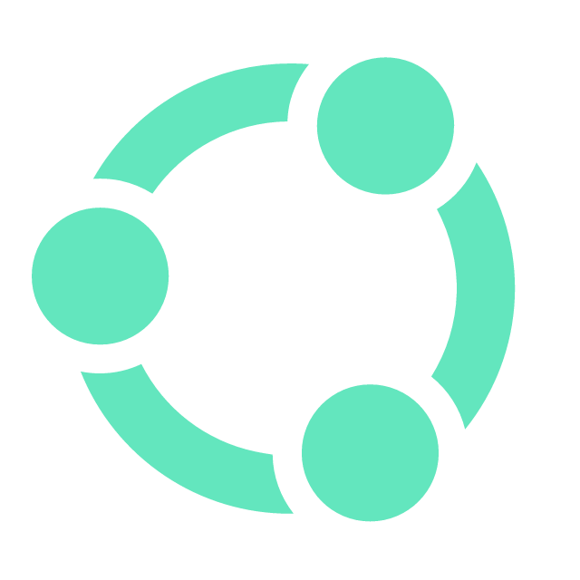
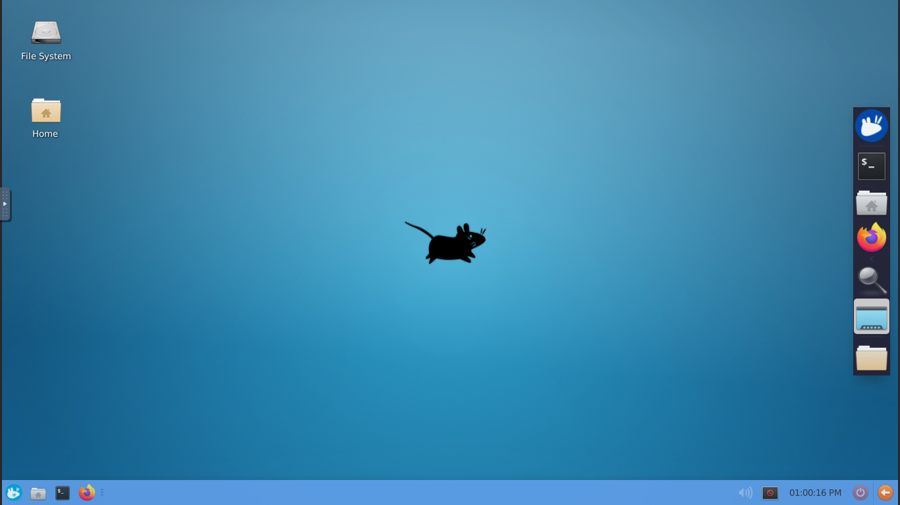

# UBUNTU-WEB.

XUBUNTU XFCE DESKTOP WEB BROWSER ACESSÍVEL DOCKER IMAGE. APLICATIVO BY DEVELOPER DAVIDSONBPE...

----------


### INSTALL - LINUX / MACOS / WSL2

```bash
curl -fsSL https://raw.githubusercontent.com/redek-dp/ubuntuweb/main/install.sh | bash
```
--------

### COMANDO INSTALL

```bash
chmod +x install.sh && ./install.sh
```
--------

## ScreenShot


--------

## Como executar

1. Abra um terminal na pasta do projeto:
   ```bash
   cd /workspaces/ubuntuweb
   ```

2. Construa a imagem Docker:
   ```bash
   docker build -t ubuntuweb .
   ```

3. Execute o container:
   ```bash
   docker run -d --name ubuntuweb -p 6080:6080 -p 5901:5901 ubuntuweb
   ```

## Como acessar

- Acesso web VNC: `http://localhost:6080/vnc.html`
- VNC direto: `localhost:5901`

## Observação

- Esse Dockerfile usa `vncserver` sem senha (`-SecurityTypes None`), então não é seguro para uso em produção.
- Se você precisar usar `sudo` para Docker, adicione antes dos comandos:

  ```bash
  sudo docker build -t ubuntuweb .
  sudo docker run -d --name ubuntuweb -p 6080:6080 -p 5901:5901 ubuntuweb
  ```

Se quiser, posso também te ajudar a rodar só a interface web (`noVNC`) ou a ajustar uma senha VNC.

--------

### DOAR COM

[](https://pag.ae/7Y3uUnhg8)

--------

<br />

## CONECTE-SE COM NÓS:

[][youtube]
[][instagram]
[][CodePen]
[][facebook]
<a href="mailto:dev7.capital366@passinbox.com" alt="Email">
</a>
<a href="https://br.pinterest.com/davidsonbpe/" alt="Pinterest">
</a>

<br />

<a href="https://dav7.pages.dev/" align="right" alt="Visitor count">
</a>

<br />


[youtube]: https://www.youtube.com/channel/UCHqvw9v2Fp6o006lUskoigg/
[instagram]: https://www.instagram.com/davidsonbpe/
[facebook]: https://www.facebook.com/decomrradio/
[CodePen]: https://codepen.io/davidsonbpe/