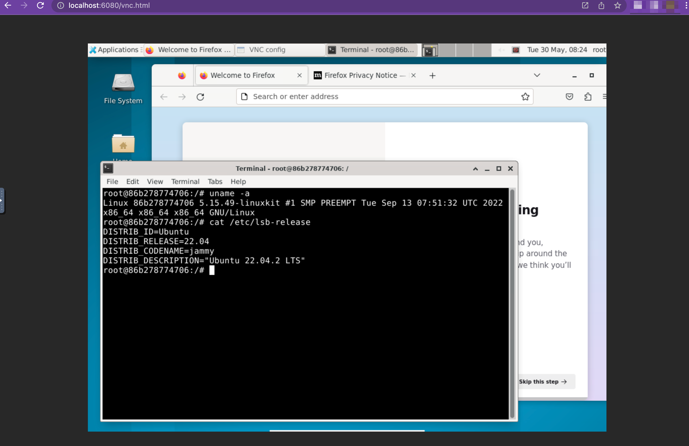

# ubuntu-web
Ubuntu Desktop Web Browser Accessible Docker Image

## ScreenShot


## Usage
```
$ docker run -it --platform=linux/amd64 -p 6080:6080 akarita/docker-ubuntu-desktop
```

## Access
```
http://localhost:6080/vnc.html
```

or

```
https://localhost:6080/vnc.html
```

## DockerHub

https://hub.docker.com/r/akarita/docker-ubuntu-desktop

## Docker Pull
```
$ docker pull akarita/docker-ubuntu-desktop
```

## Docker Build
```
$ docker build . -t docker-ubuntu-desktop
```

## License
MIT License (c) 2025 [docker-ubuntu-desktop](https://github.com/takahashi-akari/docker-ubuntu-desktop)


Verificando o Dockerfile para te orientar com o comando correto.

Read [Dockerfile](file:///workspaces/ubuntuweb/Dockerfile)

## Como executar

1. Abra um terminal na pasta do projeto:
   ```bash
   cd /workspaces/ubuntuweb
   ```

2. Construa a imagem Docker:
   ```bash
   docker build -t ubuntuweb .
   ```

3. Execute o container:
   ```bash
   docker run -d --name ubuntuweb -p 6080:6080 -p 5901:5901 ubuntuweb
   ```

## Como acessar

- Acesso web VNC: `http://localhost:6080`
- VNC direto: `localhost:5901`

## Observação

- Esse Dockerfile usa `vncserver` sem senha (`-SecurityTypes None`), então não é seguro para uso em produção.
- Se você precisar usar `sudo` para Docker, adicione antes dos comandos:
  ```bash
  sudo docker build -t ubuntuweb .
  sudo docker run -d --name ubuntuweb -p 6080:6080 -p 5901:5901 ubuntuweb
  ```

Se quiser, posso também te ajudar a rodar só a interface web (`noVNC`) ou a ajustar uma senha VNC.